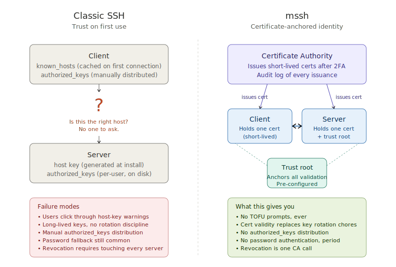
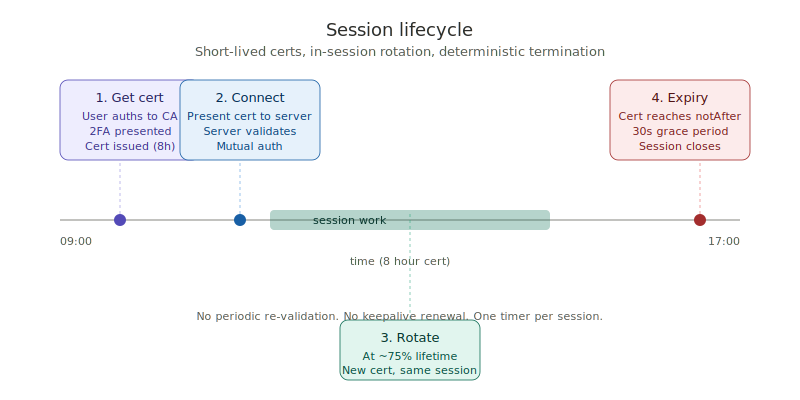
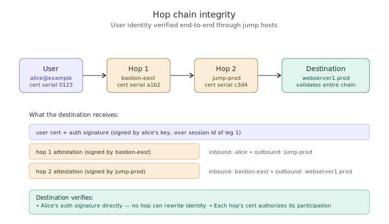
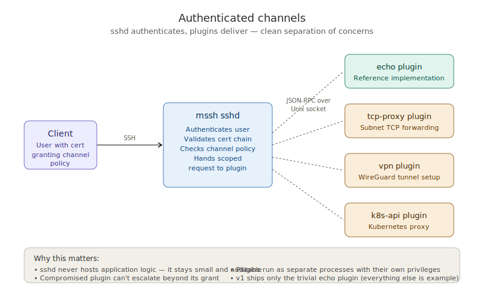
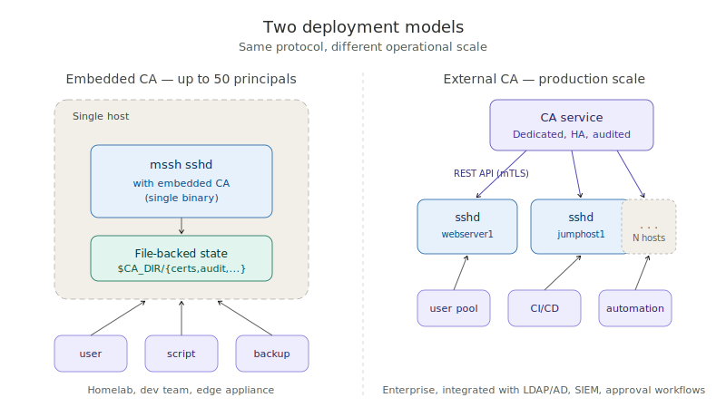

# mssh: A cert-first SSH

**An executive overview**

---

## What this is

mssh is a modernized SSH protocol and reference implementation that replaces SSH's 1990s-era trust model with a certificate-based one. It keeps everything that works about SSH — the transport layer, the channel protocol, SFTP, port forwarding, the user experience — and replaces the parts that have aged badly: TOFU host-key acceptance, long-lived user keys, manual `authorized_keys` distribution, password authentication, and the operational debug experience.

The protocol is designed to be interoperable across implementations (the spec is permissively licensed), to coexist with classic SSH during migration, and to support both tiny embedded deployments (routers, IoT) and large enterprise fleets. The reference implementation will ship under Apache 2.0.

This document is for technical decision-makers. The detailed design lives in `docs/design/`; the normative wire specification lives in `docs/spec/`; this overview is the human-readable executive summary.

---

## The problems mssh addresses

SSH has been remarkably durable — three decades of service, ubiquitous deployment, the universal language of remote administration. But the cost of that durability has been preserving design choices that made sense in 1995 and are increasingly painful in 2026.

**Trust on first use is the original sin.** When a user connects to a new host for the first time, classic SSH asks them to verify a fingerprint they cannot possibly verify. They type `yes`. The host key is cached. From that moment, SSH's security depends on the key never changing — but legitimate key rotation is operationally painful, so it rarely happens. The TOFU model has become a liability everyone tolerates.

**Long-lived keys outlive their owners.** A typical SSH key lives for years. It exists on developer laptops, in deployment pipelines, in backup scripts. When that laptop is lost or that developer leaves, revoking the key everywhere it might be authorized is a manual hunt across hundreds of `authorized_keys` files. Most organizations don't try.

**`authorized_keys` distribution is a configuration management problem disguised as security.** Every server needs to know which users may log in. Synchronizing this list across a fleet requires Ansible or Puppet or Chef or hand-edited files — and gets it wrong regularly.

**Password authentication won't die.** SSH supports it; sshd ships with it enabled in most distributions; users want it; and it's the single largest attack surface in the SSH ecosystem. Every operator knows passwords should be disabled, and most never quite get around to it.

**Debugging is genuinely painful.** "Permission denied (publickey)" tells you nothing. The user has no idea why; the server admin has to dig through logs; the iteration cycle is slow. Users learn to add `-i ~/.ssh/specific_key` and `IdentitiesOnly yes` to escape the problem, but that's a workaround, not a fix.

---

## Compatibility: meeting SSH where it actually lives

The single most important fact about SSH in 2026 is that almost nobody uses certificates. SSH public keys, on the other hand, are everywhere — in every developer's `~/.ssh/`, in every GitHub account, in every cloud dashboard, in CI runner secrets, in `authorized_keys` files on millions of servers. A protocol redesign that requires abandoning all of this is a protocol redesign that nobody adopts.

mssh's answer: **the cert is a CA-attested wrapper around the user's existing public key, not a replacement for it.** Users enroll their existing SSH keys into the CA, which issues a cert binding the public key to the user's identity with policy extensions. The private key never moves. SSH agents, key files, and tooling continue to work unchanged. The same key that authenticates to GitHub continues to authenticate to GitHub.

Servers can be configured along a spectrum:

- **`mssh-only`** — Require cert-bearing auth. Recommended for production after enrollment is complete.
- **`mssh-preferred`** — Accept either cert-bearing or bare public-key auth. Cert-bearing gets full policy enforcement; bare-key gets baseline access. The transitional posture during user enrollment.
- **`classic-only`** — Accept only bare public-key auth. For testing and edge cases.

This compatibility model is what makes a migration realistic. Organizations don't need a flag day. Users enroll on their own schedule. Servers tighten policy gradually as enrollment fills in. Coexistence is bounded by required `Until` dates — backward compatibility is a sunset, not an indefinite state.

See `docs/design/15-ssh-key-compatibility.md` for the full migration model.

---

## The mssh trust model

The fundamental change: identity comes from certificates issued by a Certificate Authority, validated against a configured trust root, not from cached host keys or distributed authorized keys.

Every user has a cert. Every host has a cert. The certs are short-lived (hours for users, days for machines). The CA enforces issuance policy (2FA, source restrictions, time windows, channel grants). The trust root is configured once on every host and never changes (or changes very rarely, with proper ceremony).

Connection is direct mutual authentication: the user's client presents the user's cert, the server presents its cert, both validate against the shared trust root. No prompts. No cached fingerprints. No iteration over multiple keys. Either it works, or it fails with a specific, debuggable reason.

---

## What a session looks like

A user's day with mssh:

In the morning, the user authenticates to the CA (smartcard, TOTP, whatever the deployment requires). They get a cert valid for 8 hours. They connect to whatever servers they need throughout the day — no further authentication friction, because the cert is the credential. At about the 75% mark of the cert's lifetime, the client automatically rotates: requests a new cert from the CA, signals it to the server mid-session, the session continues without interruption. At the cert's hard expiry, the session ends cleanly with a 30-second warning. The user goes home; no credentials linger on their machine in a meaningfully attackable form.

This model has properties that classic SSH does not:

- **The worst-case exposure of any credential is the cert lifetime.** A stolen 8-hour cert is, at most, 8 hours of damage. Long-lived keys (sometimes years old) are gone.
- **Revocation is meaningful.** Revoking a cert at the CA causes every server to refuse it on the next validation. No more "did everyone get the memo to remove that key?"
- **Audit is complete.** Every cert issuance is logged at the CA. Every connection is logged at the server. The cert serial number ties them together — when something looks wrong, you can trace it end to end.
- **2FA freshness is enforceable.** The cert records when 2FA was last presented. Servers can require fresh 2FA for sensitive operations. The "I logged in six months ago and never closed my session" problem doesn't exist.

---

## Multi-hop access without compromise

A common pattern in real deployments: users reach production hosts through bastion hosts. Classic SSH does this with `ProxyJump`, which is a TCP forwarder — the bastion can see all the traffic, but cannot vouch for the user's identity to the destination. The destination trusts whatever the bastion claims.

mssh treats hops as first-class participants in the trust chain:

When a user transits intermediate hops to reach a destination, each hop adds its own signed attestation to a chain. The user's original authentication signature passes through unchanged — no hop can rewrite the user's identity. The destination validates the entire chain end-to-end, including each hop's authorization to be part of it. A compromised hop can log session contents (this is unavoidable for any forwarded session), but it cannot impersonate the user to the destination.

The user's certificate also specifies which intermediate hops they may use — by cluster, by pattern, or by exact identity — so a stolen user cert cannot be relayed through paths the legitimate user would not have used.

---

## Extending without compromising

Real deployments need more than SSH shells. VPN access. Database proxies. Kubernetes API gateways. Audit recording. Custom internal services. Classic SSH has port forwarding (`-L`, `-R`, `-D`), which has been pressed into service for all of these — clumsily, with security policy bolted on out-of-band.

mssh provides a clean extension mechanism: authenticated channels.

When a user connects, their cert may grant access to specific "channel types." A user's cert might say "you may open an `echo` channel" or "you may open a `tcp-proxy` channel to subnets 10.0.1.0/24" or "you may open a `k8s-api` channel for namespaces `prod-web` and `prod-data`." On connection, sshd authenticates the user, checks the channel grants, and hands a pre-authorized request to a separate plugin process. The plugin does the application-specific work — WireGuard tunnel setup, TCP forwarding, Kubernetes API proxying, whatever — within the scope the cert granted.

The architectural point is that sshd never knows what these plugins do, and the plugins never authenticate users. Each side does what it's good at: sshd handles the cryptographic identity work, plugins handle application-specific concerns. The interface between them is a small JSON-RPC protocol over a local Unix socket.

In v1, mssh ships exactly one plugin: a trivial `echo` reference implementation. Everything else — VPN, proxy, k8s — is for third parties (or future projects) to build. The discipline is deliberate: ship the framework, validate it works, let the ecosystem provide the variety.

---

## Two deployment models

mssh fits at both ends of the scale spectrum.

For small deployments — a homelab, a development team, an edge appliance — the CA runs inside sshd itself. A single binary, file-backed state, no external dependencies. Setup takes under five minutes; the operational footprint is essentially zero. The embedded CA caps at 50 principals, which is enough for a wide range of small uses.

For larger deployments, the CA is a separate service: HA, audit-integrated, LDAP/AD-backed, with approval workflows and SIEM integration. The protocol between sshd and the CA is the same in both cases (a REST API), so tooling that works against one works against the other. Graduating from embedded to external requires no SSH client changes.

For embedded devices — Dropbear-class targets like OpenWrt routers — mssh defines a "constrained profile" that strips out the heavy parts (CRL, OCSP, online revocation checks) in favor of short-lived certs and a fixed trust root. A constrained mssh implementation fits in about 360 KB of binary plus mbedTLS or BearSSL, which is appropriate for IoT and embedded deployments.

---

## What we explicitly did not do

Discipline in scope is what makes the project realistic. mssh deliberately does not:

- **Replace the SSH transport layer.** SSH-TRANS (KEX, ciphers, MACs) is good and we use it unchanged.
- **Replace SFTP or scp.** These work over the existing channel protocol; cert-based auth is transparent to them.
- **Embed a VPN.** The channel framework supports VPN plugins; no VPN ships.
- **Embed a DNS resolver.** The system resolver is used, with DNSSEC required.
- **Replace SSH's connection protocol.** Channels, port forwarding, agent forwarding, X11 forwarding all work as before.
- **Support password authentication.** Not as a fallback, not as a recovery path, not in legacy mode. The single largest classic SSH attack surface is gone.

mssh is an SSH hardening, not a from-scratch rewrite. The on-wire protocol changes are minimal: a replacement user-authentication method, a new hop-chain attestation message, new rotation and extension messages, and one new channel type. Everything else is unchanged.

---

## Migration path

mssh and classic SSH coexist, with sunset dates, in both directions: an mssh-aware host can reach legacy SSH servers (configured via `LegacyHost`), and an mssh-aware server can accept classic-SSH clients (configured via `AuthenticationMode` and `LegacyClientAccess`). Both directions require explicit `Until` dates and `Reason` strings; past the date, the legacy entry stops working, and the operator either renews the date or completes the migration.

The two directions move on different schedules. Server-side hosts get upgraded as their operators have capacity. User enrollment happens as users have time to run the enrollment tool. An organization can be partway through both processes simultaneously — that's the normal state during a migration, not an exceptional one.

The protocol supports a defined "legacy onboarding" flow for hosts: when a legacy host is finally upgraded, it submits a CSR signed by its existing classic SSH host key, proving continuity of identity. The CA issues an mssh cert; the legacy entry on peer hosts is removed; the migration is complete for that host.

For user enrollment, the workflow is similarly continuous: the user's existing SSH key is wrapped in a cert by the CA. The same key continues to work for classic destinations (GitHub, unmigrated servers); the same key now also satisfies mssh-aware servers in cert-bearing mode. The user has not changed credentials, only added metadata.

For organizations with a large SSH footprint, the migration is gradual along both axes. There is no flag day. There is no requirement to migrate everyone simultaneously. The forcing functions (sunset dates, audit visibility, operational friction of legacy entries) push the migration along on the deployment's own schedule.

---

## Standards orientation

The protocol spec is permissively licensed and intended for multiple implementations. Goals:

- Be implementable in any reasonable language with standard crypto libraries.
- Be small enough that a careful implementer can read the entire spec in a sitting.
- Avoid wire-level dependencies on any specific implementation's quirks.
- Be tractable for embedded targets via the constrained profile.

If the protocol gains traction, the eventual home would be IETF, with mssh-the-implementation being the reference. The spec is structured (RFC-style sections, error code registries, IANA considerations) to make that transition straightforward when it makes sense.

---

## What's in this repository today

This repository currently contains design documentation only — no source code yet. The documents define the protocol and reference architecture in enough detail that implementation can begin.

- `docs/design/` — Fifteen design documents covering every aspect of the system. The README in that directory gives a reading order.
- `docs/spec/mssh-protocol.md` — The normative wire specification, RFC-style, suitable for handing to an implementer.
- `docs/exec/` — This document and its diagrams.

A reference implementation (likely in Go, possibly with a Rust alternative) is the natural next phase. The design is intentionally implementation-agnostic; the spec should support multiple reference implementations and any number of third-party implementations.

---

## Why now

Three observations made this design feasible in 2026 in a way it would not have been in, say, 2015:

**Hardware-backed key storage is ubiquitous.** TPMs, Secure Enclaves, smartcards, FIDO2 tokens — the user's private key can live in hardware that prevents extraction, which is the foundation of a short-lived cert model. Without this, the gains over classic SSH would be more modest.

**DNSSEC validation is finally common.** Systemd-resolved, unbound, dnsmasq, recent macOS/Windows — DNSSEC AD bits propagate to applications in standard deployments. The defense-in-depth posture against DNS tampering is now operationally realistic.

**Operational expectations have matured.** Modern infrastructure teams expect short-lived credentials (AWS STS, Vault, Kubernetes service accounts), audit logs as a first-class concern, and automated rotation as the default. Classic SSH's long-lived-keys-and-manual-everything model is increasingly the odd one out. The cultural ground is prepared.

---

## What this would cost an organization to adopt

Honest accounting:

**Up-front:**
- Set up a CA (an afternoon for the embedded CA; a project for production-scale).
- Distribute the trust root to every host (configuration management, one file per host).
- Update sshd configuration to enable mssh, typically starting in `mssh-preferred` mode (per host).

**Per-user enrollment (the user-facing migration):**
- Each user runs the enrollment tool against their existing SSH key. About 60 seconds per user, mostly waiting for 2FA. Self-service; no admin intervention needed for most users.
- Users with unusual setups (multiple keys, hardware tokens, non-standard agents) may need help. Plan for ~5% of the user base needing direct support.
- Total elapsed time for an organization of N users typically dominated by communication, not technology. Plan for weeks to months.

**Per-host migration (the server-side change):**
- Deploy mssh sshd. The binary replaces or augments classic sshd.
- Configure trust root, `AuthenticationMode`, and any `LegacyHost` entries needed for outbound connections.
- Tighten to `mssh-only` when enrollment coverage is sufficient.

**Ongoing:**
- Users obtain certs daily (5 seconds at session start with 2FA cached on smartcard; 30 seconds when 2FA needs to be re-presented). The underlying SSH key doesn't change.
- Hosts rotate machine certs on schedule (automated, no human intervention).
- Operators monitor the CA audit log for anomalies (any SIEM integration handles this).

**One-time, gradual:**
- Phase out `mssh-preferred` mode on individual hosts as their user base is fully enrolled.
- Sunset `LegacyHost` entries as outbound peers upgrade. The forcing-function dates make this organic.

**What goes away:**
- Distributing `authorized_keys` *as the primary auth mechanism*. (It remains a fallback during `mssh-preferred` migration; eliminated entirely once an organization reaches `mssh-only`.)
- Hunting down old SSH keys when someone leaves. Revocation at the CA handles it.
- Host-key prompt fatigue. Gone — replaced by cert validation.
- "Permission denied (publickey)" debugging marathons. Replaced with specific local errors.
- Password auth as a residual concern. Gone immediately, regardless of migration state.

**What does not go away:**
- The user's existing SSH key. They keep it. Forever, if they want.
- Their key's enrollment in third-party services (GitHub, GitLab, cloud providers). Unaffected.
- Their SSH agent. Unaffected.
- Their `~/.ssh/config` aliases. Unaffected (apart from possibly removing `StrictHostKeyChecking no` workarounds that mssh makes unnecessary).

The net is positive for any organization beyond a couple of hosts. The gains scale with the size of the SSH footprint — the bigger the fleet, the more authorized_keys management hurts and the more cert-based identity pays off. The compatibility model means the gains are realized gradually rather than requiring a flag day.

---

## Where to go from here

If you've read this and want to dig deeper:

- **For the design rationale on any specific aspect:** `docs/design/<topic>.md`.
- **For the wire-level protocol:** `docs/spec/mssh-protocol.md`.
- **For the threat model:** `docs/design/12-threat-model.md`.

If you're considering implementation, contributing, or piloting:

- The reference implementation is not yet started. We'd welcome conversation about it.
- The protocol is in draft. Feedback on the design — particularly from operators and security engineers — is the most valuable thing we can receive right now.
- The license intent is Apache 2.0 for the implementation, CC-BY-4.0 for the specification. See `LICENSE` and `LICENSE-NOTE.md`.

mssh is open work in the open. Pull requests, issues, design discussions all welcome.
